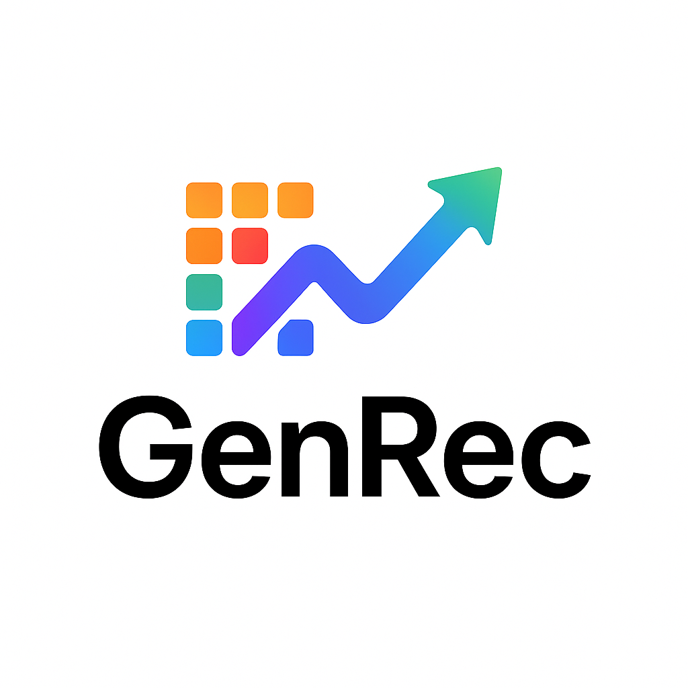

# GenRec

  

$\textbf{GenRec}$: A unified **Gen**erative **Rec**ommendation toolbox that simplifies end-to-end generative recommender research.  
📘 [arXiv Paper (coming soon)](https://arxiv.org/abs/2501.xxxxx)  
:point_right: Check our **survey on generative recommendation (2025)** (to appear).  
:point_right: Explore **awesome resources on GenRec** → [Generative Recommendation Resources](https://github.com/yourname/GenRecHub-Resources).  

---

## 🔧 Toolbox Overview

  

GenRecHub provides a modular and reproducible pipeline for **end-to-end generative recommendation**.
It unifies data preprocessing, tokenization, generation, and evaluation under a single configuration-driven framework.

---

# ⚙️ Capability Matrix

## Dataset

| Dataset | Implemented |
|--------------------|--------------|
| Amazon | ✅ |

## 💬 Embedding Extraction
| Category | Component / Method | Implemented |
|-----------|--------------------|--------------|
| 🧠 Textual | Sentence Embedding | ✅ |
|  | OpenAI Embedding API | ✅ |
|  | Local LLM Embedding (Qwen2.5, MiniCPM) | ✅ |
| 🖼️ Visual | CLIP / BLIP2 Encoder | ✅ |
|  | Multimodal Fusion | ✅ |
| 👥 Collaborative | SASRec Sequence Embedding | ✅ |
| 🧩 Management | PCA Compression & Storage | ✅ |

## 🧩 Quantization
| Category | Component / Method | Implemented |
|-----------|--------------------|--------------|
| 🔸 Residual Family | RQ-VAE | ✅ |
|  | R-KMeans | ✅ |
|  | VQ-VAE   | ✅ |
|  | R-VQ     |   |
| 🔹 Product Family | OPQ | ✅ |
|  | PQ   | ✅ |

## ⚙️ Recommendation Architecture
| Category | Component / Method | Implemented |
|-----------|--------------------|--------------|
| 🧠 Encoder–Decoder | T5-style Seq2Seq | ✅ |
| 💬 Decoder-Only | GPT-style Autoregressive | - |
| 🔍 Encoder + Retrieval | Retrieval-Augmented Encoder | ✅ |
| 🔧 Plugins | Beam Search | ✅ |
|  | Prefix Tree Constraint | - |

---

## 📦 Supported Models

| **Category** | **Model** | **Paper** | **Conference/Journal** | **Code** |
|---------------|------------|-----------|------------------------|-----------|
| **Tokenization & Quantization** | TIGER | [Residual Quantized Variational Autoencoder for Discrete Representation](https://arxiv.org/abs/2305.14422) | CVPR’23 | rqvae.py |

---

# Usage

