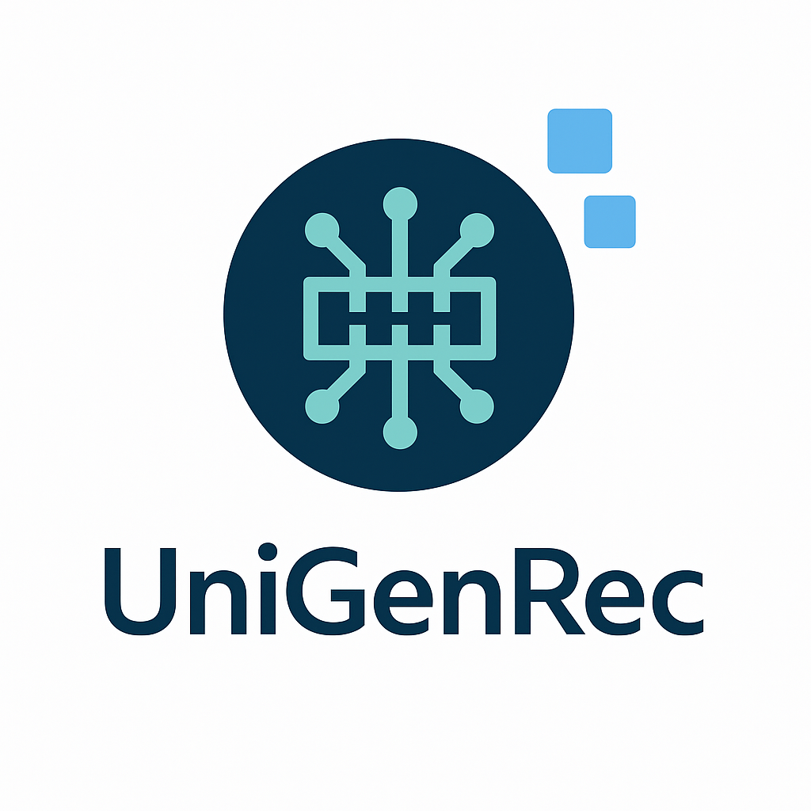

<div align="center">
  

  <h1>UniGenRec: A Unified Generative Recommendation Toolbox</h1>

  <p>
    <strong>Modular • Configuration-Driven • Reproducible</strong>
  </p>

  <p>
    <a href="https://arxiv.org/abs/XXXX.XXXXX"></a>
    <a href="https://github.com/yourname/UniGenRec/blob/main/LICENSE"></a>
    
    
  </p>
</div>

---

**UniGenRec** is an open-source, end-to-end framework designed to standardize the **Generative Recommendation (GenRec)** workflow. It provides a reproducible pipeline covering **Representation → Tokenization → Modeling → Training → Inference**.

📘 arXiv Paper (coming soon)  

## 🔥 Motivation
Generative Recommendation is shifting the paradigm from **scoring/matching** to **generative modeling**. However, the current ecosystem is **highly fragmented**:
* **Inconsistent Tokenization:** Diverse quantization methods (RQ-VAE, VQ-VAE, OPQ, RKMeans) make inputs incompatible.
* **Varied Backbones:** Architectures range from Encoder–Decoder (T5/BART) to Decoder-only LLMs (Llama/GPT).
* **Disparate Pipelines:** Training and inference strategies (Beam Search vs. Prefix-tree) vary significantly between implementations.

**The Result:** Models are difficult to compare, hard to extend, and often unreproducible.

## 🎯 Our Goal
**UniGenRec** solves this by providing a **single, plug-and-play stack** that unifies the entire lifecycle.

- **🧩 Fully Modular:** Decoupled components for Tokenization, Backbones, and Inference.
- **⚙️ Config-Driven:** Manage complex experiments with simple YAML configurations.
- **📊 Fair Comparison:** Benchmarking SOTA models (TIGER, Letter, RPG, etc.) under the same setting.
- **🔬 Standardized SID Modeling:** The first open-source standardization for Semantic ID-based recommendation.

# 🔧 Pipeline Overview

```
Raw Data
↓
Download + Preprocessing
↓
Embedding Generation (Text / Image / CF / VLM)
↓
Multimodal Fusion (optional)
↓
Quantization (RQ-VAE / OPQ / PQ / RKMeans)
↓
Generative Recommender (TIGER / RPG / LETTER / LLMs)
↓
Inference (Beam Search / Prefix-tree / Contrastive Rerank)
```


---

# 🧱 Capability Matrix

| Dimension | Category | Supported Components | Status |
|----------|----------|----------------------|--------|
| **Data** | Datasets | Amazon, MovieLens | ✓ |
|          | Input Formats | Raw IDs, Embeddings, Codebooks (SID) | ✓ |
| **Representation** | Text | Qwen, T5, OpenAI Embedding API | ✓ |
|                   | Vision | CLIP ViT | ✓ |
|                   | Collaborative | SASRec | ✓ |
|                   | Fusion | Concat, MLP Fusion | ✓ |
| **Quantization** | Residual Family | RQ-VAE, Residual KMeans, Residual-VQ | ✓ |
|                                | Product Family | OPQ, PQ | ✓ |
|                                | Other | VQ-VAE, Multi-Codebook (RPG-style) | ✓ |
| **Backbone** | Encoder–Decoder | TIGER-style architectures | ✓ |
|              | Decoder-only LLM | GPT-2, Qwen, LLaMA | ✓ |
|              | Retrieval-Hybrid | RPG-style architectures | ✓ |
| **Training** | Objectives | LM Loss, Contrastive Loss, Hybrid Loss | ✓ |
|              | Paradigms | SFT, Alignment, Multi-stage Training | ✓ |
| **Inference** | Decoding | Greedy, Beam Search | ✓ |
|               | Constraints | Prefix-Tree | ✓  |


# 🚀 Quick Start


**Requirements**
- Python **3.10** (recommended)
- CUDA 11.8+ (for GPU acceleration)
- PyTorch, CUDA, and other dependencies will be installed automatically via `requirements.txt`

```bash
git clone https://github.com/yourname/UniGenRec
cd UniGenRec
pip install -r requirements.txt
```
## 1 Data Preprocessing

We provide a dedicated submodule for downloading, cleaning, and extracting embeddings (Text/Image/CF).

👉 **See detailed tutorial:**  
[GenRec-Factory Data Processing & Embedding Guide](./preprocessing/ReadMe.md)


## 2 Quantization

Convert dense embeddings into discrete Semantic IDs (SIDs)

```bash
cd quantization

python main.py \
  --model_name rqvae \
  --dataset_name Musical_Instruments \
  --embedding_modality text \
  --embedding_model text-embedding-3-large
```

## 3 Generative Recommendation Models

Train a generative recommender using the generated SIDs.

```bash
cd recommendation

python main.py \
  --model TIGER \
  --dataset Baby \
  --quant_method rqvae
```
